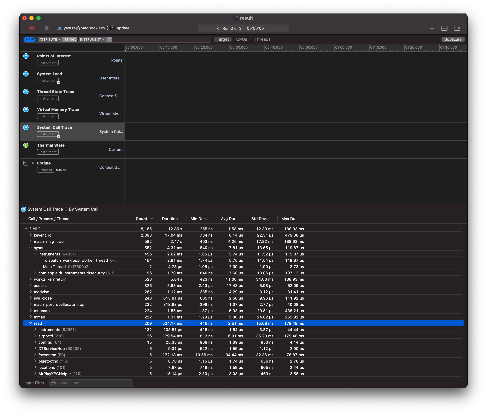

# Strace 相关

## Linux

### 背景：
在Linux世界，进程不能直接访问硬件设备，当进程需要访问硬件设备(比如读取磁盘文件，接收网络数据等等)时，必须由用户态模式切换至内核态模式，通过系统调用访问硬件设备。strace可以跟踪到一个进程产生的系统调用,包括参数，返回值，执行消耗的时间。

strace 常用来跟踪进程执行时的系统调用和所接收的信号，当然strace对于代码里的死循环是解决不了的。比如你发现一个进程 CPU 100% 了，strace 恐怕是解决不了的。因为 strace 是看系统调用，一般都是 IO 类操作，既然是 IO 密集，那 CPU 一定不可能是100%。

### 语法：
- strace -f -F <command>
    - 比如 `strace php abc.php`
    - 比如 `strace node abc.js`
    - -f -F 同事跟踪 fork 和 vfork 出来的进程
- strace -o output.txt -T -tt -e trace=all -p <process-pid>
    - -e trace=all 跟踪 pid 所有的系统调用
    - -T 统计系统调用花费的时间
    - -tt 开始时间(更多选项看 man strace)

### 例子：
`uptime` 会读取 `/proc/uptime` 和 `/proc/loadavg` 获取详细信息，怎么去判断的呢？
```bash
$ strace uptime 2>&1 | grep open
...
open("/proc/uptime", O_RDONLY)          = 3
open("/var/run/utmp", O_RDONLY|O_CLOEXEC) = 4
open("/proc/loadavg", O_RDONLY)         = 4
```
也可以使用`strace -e open uptime` 获得更加简便的，也可以通过 `strace -e trace=file -f uptime`获取结果相对复杂。


## macOS

macOS 也有类似

### 背景
- dtruss [-acdeflhoLs] [-t syscall] { -p PID | -n name | command }

> 安全问题：sudo dtruss [dtruss_options] -f sudo -u $USER myprogram [program_options]

- iosnoop: snoop I/O events as they occur. Uses DTrace.
- opensnoop, execsnoop, 这个可以找到使用 dtrace 相关的都不能用`man -k dtrace`
这些都是关于对应的系统调用，但都需要关闭系统保护，不然直接诶调用 dtrace 就会出现下面的内容：

```
dtrace: error on enabled probe ID 1712 (ID 564: syscall::sysctl:return): invalid user access in action #5 at DIF offset 0
dtrace: error on enabled probe ID 1712 (ID 564: syscall::sysctl:return): invalid user access in action #5 at DIF offset 0
dtrace: error on enabled probe ID 1930 (ID 832: syscall::proc_info:return): invalid user access in action #5 at DIF offset 0
dtrace: error on enabled probe ID 1930 (ID 832: syscall::proc_info:return): invalid user access in action #5 at DIF offset 0
dtrace: error on enabled probe ID 1712 (ID 564: syscall::sysctl:return): invalid user access in action #5 at DIF offset 0
dtrace: error on enabled probe ID 1712 (ID 564: syscall::sysctl:return): invalid user access in action #5 at DIF offset 0
dtrace: error on enabled probe ID 1930 (ID 832: syscall::proc_info:return): invalid user access in action #5 at DIF offset 0
```
所以使用 XCode 提供的 instruments 才是更好的方案:

### instruments 语法
- instruments [-w device] [-t template] [-D document] [-l timeLimit] [-i #] [[-p pid] | [application [-e variable value] [argument ...]]]

### instruments 例子：
使用 instruments 来查看调用：
- instruments -D result.trace -t 'System Trace' /usr/bin/uptime
- open result.trace

就可以看到对应的底层调用


### 关于 xctrace
这个是用来替换 instruments 的，用法先看看 man xctrace 吧，功能跟 instruments 类似。


## Ref
- 博客中非常多关于系统底层的分析：http://www.brendangregg.com/overview.html
- 关于介绍 uptime: https://peteris.rocks/blog/htop/#source-code
- 关于 PHP 的 debug: http://rango.swoole.com/archives/340
- 更多参数相关的介绍： https://linuxtools-rst.readthedocs.io/zh_CN/latest/tool/strace.html
- 关于 dtruss 安全：https://opensourcehacker.com/2011/12/02/osx-strace-equivalent-dtruss-seeing-inside-applications-what-they-do-and-why-they-hang/
- 更多关于 dtrace 详细的介绍： http://dtrace.org/blogs/brendan/2011/10/10/top-10-dtrace-scripts-for-mac-os-x/
- 介绍 instruments： https://etcnotes.com/posts/system-call/
- Instruments 手册：https://help.apple.com/instruments/mac/current/#/dev7b09c84f5
